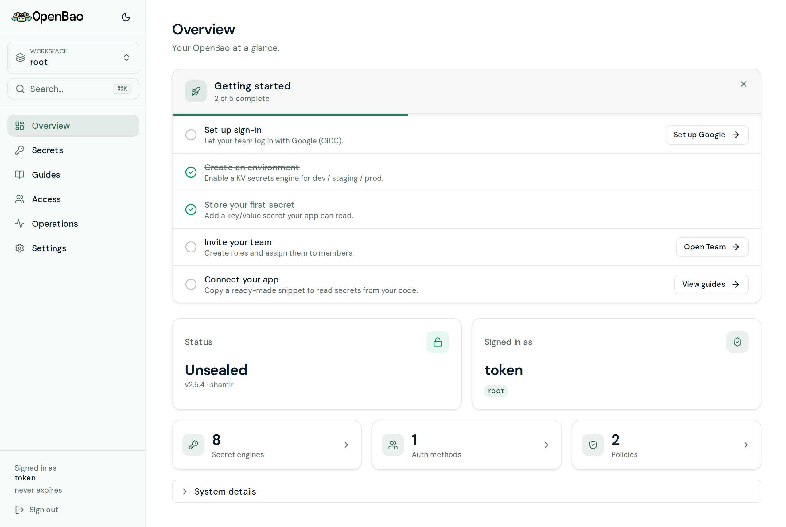
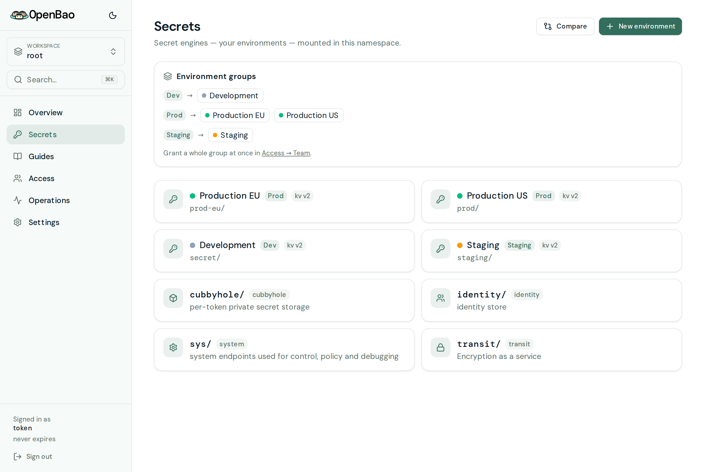
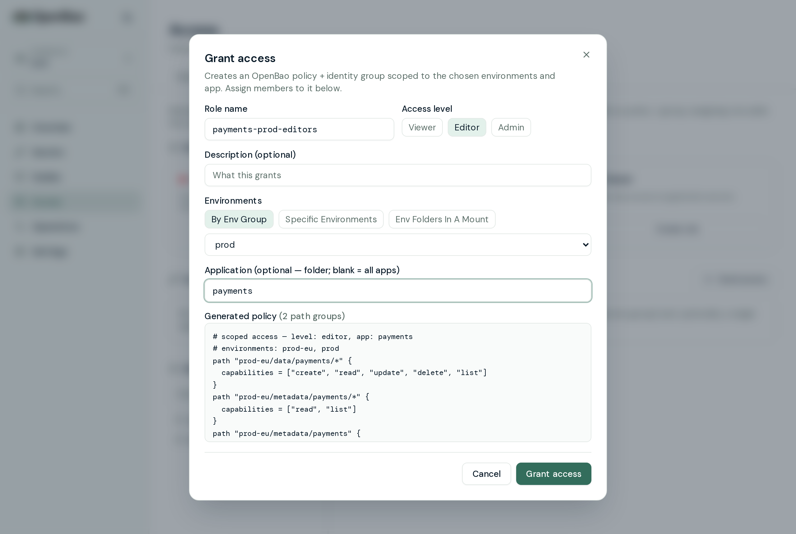
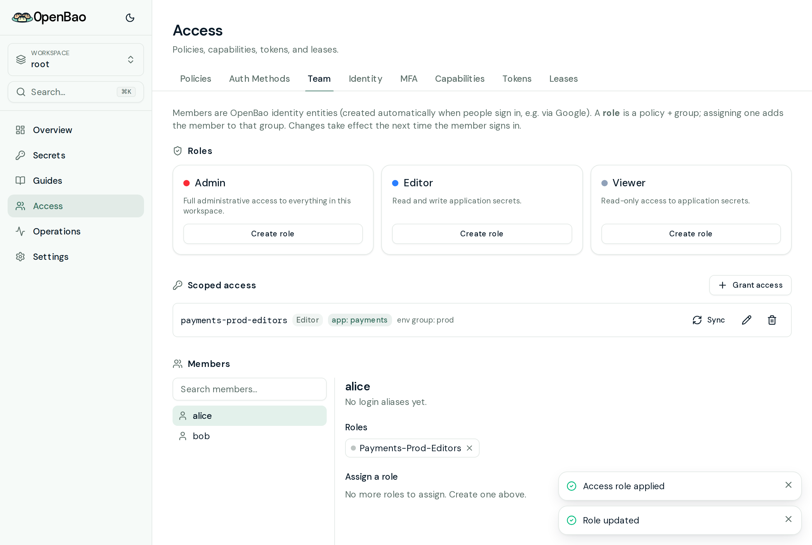
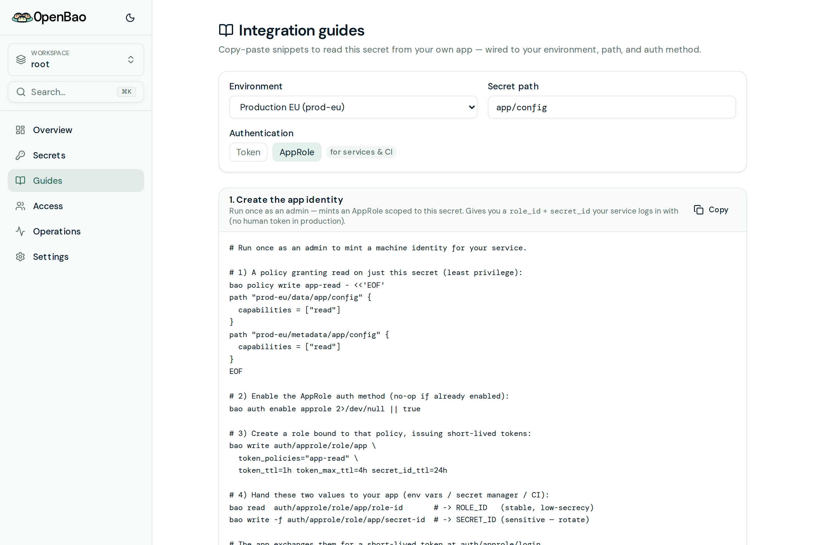
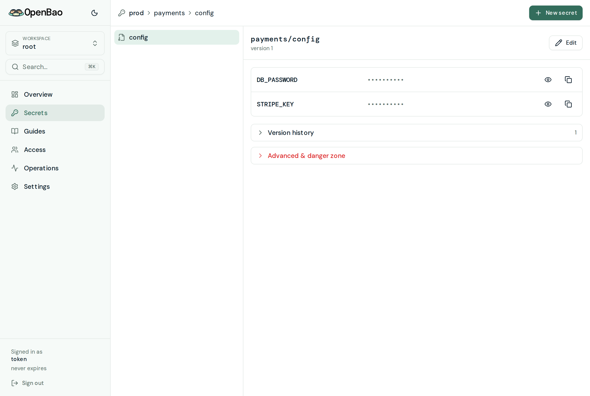

# OpenBao UI

A modern, simple UI for [OpenBao](https://openbao.org) — Infisical-style UX,
built with **Next.js**, **Tailwind CSS**, and **[coss ui](https://coss.com/ui/docs)**
(copy-paste components on Base UI). The UI and OpenBao ship in a **single Docker
image**.

## Screenshots

Create a **shareable, app-scoped access group** across an environment group —
with a live preview of the exact OpenBao policy it generates:


Give your service an **app identity (AppRole)** so it gets a short-lived, scoped
token in production — the guide is wired to your environment and secret path:


|  |  |
| --- | --- |
| <br/>**Overview** — seal status, token policies, engines | <br/>**Secrets** — environments, colors & shareable env groups |
| <br/>**Grant access** — env group × app × level → policy + group | <br/>**Team** — scoped roles + member assignment |
| <br/>**Guides** — app identity (AppRole) setup + snippets | <br/>**Secret** — KV value view |

## Architecture

Next.js is the single front door (a BFF), and OpenBao runs alongside it inside
the same image, reachable only on loopback:

```
                 ┌───────────────────────── single Docker image ─────────────────────────┐
   browser  ───► │  Next.js (:3000)                                                         │
                 │   ├── /ui2/*      → React pages (coss ui — this app)                    │
                 │   └── /ui2/api/*  → authenticated, bounded BFF route handlers          │
                 │                              │                                          │
                 │                              └──► OpenBao (127.0.0.1:8200)             │
                 └─────────────────────────────────────────────────────────────────────────┘
```

- **`/ui2/*`** — this application's pages (served under `basePath: /ui2`). The
  root `/` redirects here.
- **`/ui2/api/*`** — custom API routes. Login validates credentials against
  OpenBao server-side and stores the token in an **httpOnly cookie** — it never
  reaches client JS.
- The OpenBao stock UI (`/ui/*`) and raw OpenBao API (`/v1/*`) are deliberately
  **not** reverse-proxied. This keeps uninitialized-server bootstrap APIs off the
  public web surface.

Only port **3000** is exposed; OpenBao stays internal. See
[`docs/deployment-security.md`](docs/deployment-security.md) for operator
bootstrap and reverse-proxy requirements.

## Local development

Run OpenBao (or the bundled mock) and the UI separately:

```bash
# 1. Backend (one terminal) — real OpenBao …
bao server -dev -dev-root-token-id=root        # listens on :8200
#    … or the dependency-free mock (in-memory KV v2, no install needed):
pnpm mock:bao                                   # listens on :8200, token: root

# 2. UI (another terminal)
pnpm install
pnpm dev                                        # http://localhost:3000
```

For local development, open <http://localhost:3000> and sign in with the
**Token** method using the development-only token you supplied. The Overview
page shows live seal status, token policies, and enabled secret engines;
**Secrets** lets you browse KV engines, create/edit secrets, view version
history, and roll back — all fetched through the proxy, proving the frontend ↔
backend wiring end to end.

Config via env (see `.env.example`): `OPENBAO_ADDR`, `BAO_COOKIE_NAME`, and
**required in production** `OPENBAO_UI_PUBLIC_URL` (the canonical public HTTPS
origin used for OIDC redirects and CSRF validation).

### Architecture detail: client data flow

Interactive pages use **TanStack Query** against an **authenticated BFF proxy**
(`/ui2/api/bao/<path>`). The proxy injects the httpOnly token and the
`X-Vault-Namespace` header server-side, so the token is never exposed to client
JS while the UI still gets live, cacheable reads/writes.

## Single image (UI + OpenBao)

```bash
# Development only: explicit opt-in, loopback-bound, unsealed in-memory OpenBao.
BAO_DEV_ROOT_TOKEN_ID=choose-a-local-dev-token \
  docker compose -f docker-compose.dev.yml up --build

# Production-safe default: set OPENBAO_UI_PUBLIC_URL in .env, then initialize
# and unseal the persistent instance locally before exposing it through TLS ingress.
docker compose up --build
```

For development, visit <http://localhost:3000> and sign in with the
**Token** method using the development-only token you supplied. Do not expose
development mode publicly.

### Behind a reverse proxy

The app derives its **public origin** (used for the OIDC `redirect_uri` and the
post-login redirect) from each request's `Host` / `X-Forwarded-Host` +
`X-Forwarded-Proto` headers. That works out of the box when your proxy forwards
those headers.

If your proxy/load balancer **rewrites or drops** them — symptom: "Sign in with
Google" fails with *"OpenBao returned no authorization URL…"* pointing at an
unexpected host like `0.0.0.0:3000` — set the public URL explicitly:

```bash
docker run … -e OPENBAO_UI_PUBLIC_URL=https://bao.example.com openbao-ui
```

This pins the origin to that exact value regardless of request headers. It is
also echoed to the OIDC setup wizard, so the role's `allowed_redirect_uris` is
registered with the **same** URL the login flow sends — keep this value in sync
with the redirect URI registered in your Google/OIDC provider. Only the origin
(`scheme://host[:port]`) is used; any path is ignored.

### Versioning & releases (tag parity with OpenBao)

The published image embeds a specific OpenBao version and is **tagged to match
it**, so picking a tag picks the OpenBao inside:

| Our image (`ghcr.io/krolbot/openbao-ui`) | Embedded OpenBao |
| --- | --- |
| `:2.6.1`, `:2.6`, `:2` | `quay.io/openbao/openbao:2.6.1` |
| `:latest` | newest released OpenBao |
| `:sha-<commit>` | immutable, per-commit |

- **`.openbao-version`** records the intended OpenBao release. **`.openbao-image`**
  is the build source of truth and pins the matching upstream image by immutable
  digest. CI and local Docker builds consume the pinned image reference; do not
  replace it with a mutable tag.
- **Auto-release:** `.github/workflows/sync-openbao.yml` discovers a new OpenBao
  release, resolves its immutable image digest, and opens a PR that updates both
  pins. `publish.yml` publishes on every push to `main`.

## coss ui

Components live in `components/ui/*`. The coss registry is configured in
`components.json` (`@coss`), so real coss/Base-UI components can be pulled in via
the shadcn CLI as the UI grows:

```bash
npx shadcn@latest add @coss/<component>
```

## Features

A full management UI, not just a viewer — everything below is implemented and
talks to OpenBao live through the proxy:

**Secrets**
- KV **v2 and v1** — browse, create, and edit, with **version history,
  one-click rollback**, and soft-delete / destroy
- **Environments** — friendly names, colors, and shareable **env groups** layered
  on your KV mounts; create or disable an environment right from the UI
- **Compare** a secret path across environments side by side
- Dashboards for **Transit, PKI, SSH, Database, and Cubbyhole**

**Access**
- **Team** — members (identity entities), role templates, and **scoped access
  roles**: grant an env group + app at a chosen level with a **live preview of the
  exact policy**, materialized as a real OpenBao policy + identity group
- **Auth methods** — enable/configure userpass, LDAP, AppRole, and a guided
  **Google (OIDC) sign-in wizard**
- **Identity** (entities & groups), **policies & capabilities**, **tokens**,
  **leases**, and **MFA**

**Operations**
- Seal status / health, **quotas**, **plugins**, and an **audit log** viewer
- Built-in **initialize → save keys → unseal** bootstrap flow for fresh instances

**Settings**
- Login customization / branding, server config, password policies, preferences,
  and **multi-namespace** switching

Plus a command palette, dark mode, copy-paste **integration guides** for your
app, and a first-run onboarding checklist.

> Early but real, and actively developed. Feedback, issues, and PRs are very
> welcome.
